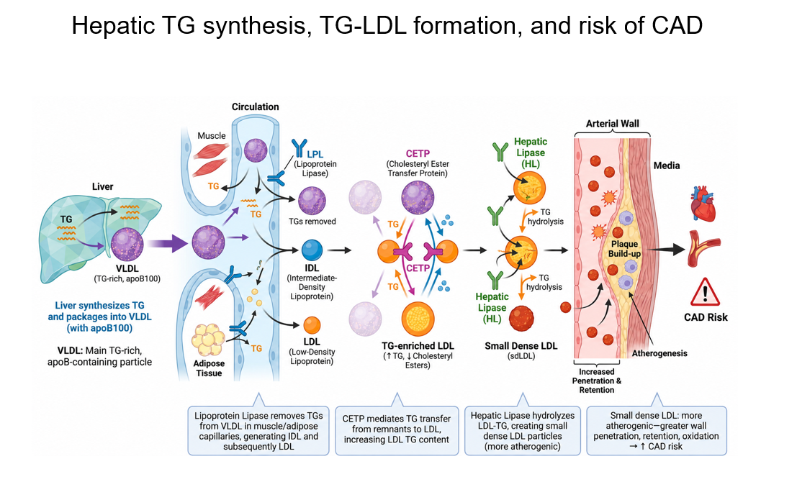
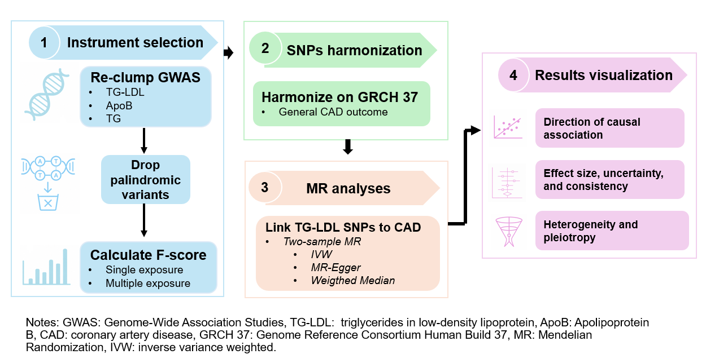
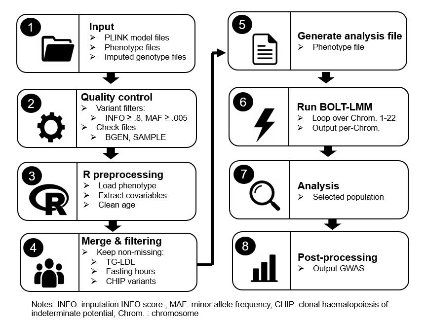

# Triglycerides in Low-Density Lipoprotein and Coronary Artery Disease Risk: Evidence from Mendelian Randomization

# Background

1. Triglyceride (TG) burden reflects the cumulative impact of elevated TG levels over time and their related cardiometabolic risks.

2. Even among statin-treated patients with controlled LDL-C, elevated TG levels are associated with substantial residual cardiovascular event risk (PMID: 30415628).

3. LDL-C mainly measures the cholesterol carried within LDL particles, but it does not fully capture cholesterol carried by TG-rich remnant lipoproteins.

4. These TG-rich, ApoB-containing remnant particles can enter and become retained in the arterial wall, thereby contributing to residual atherosclerotic risk.

5. Both Mendelian Randomization (MR) and observational have linked TG-rich lipoproteins to increased CAD risk (PMID: 23248205, 34472586)

6. Observation study found elevated TG-LDL has been robustly associated with increased ASCVD risk, supporting its potential value as an emerging lipid biomarker (PMID: 36631208).

7. Compressive study on NMR-measured lipid biomarkers confirmed that TG-LDL has strongest and most consistent association to the risk of CAD across race/ethnicity group (PMID: 38726919).

8. TG-LDL captures TG enrichment within LDL particles and better reflect remnant-driven LDL remodeling.

## Figures

### Study rationale

### Whole bioinformatics analysis pipeline

### PLINK2 LDL-TG UKB GWAS computing pipeline

## Conclusion

1. Higher TG-LDL casually associate with increased CAD risk.

2. Two SNPs mapped to the chr15q21.3 LIPC/hepatic lipase region, providing complementary support for the known TG-LDL/CAD pathway.

3. Although heterogeneity exists, identified SNPs suggesting low risk of weak instrument bias.

4. Among 8 coding-consequence SNPs, several are linked to lipid or cardiometabolic pathways, particularly rs693 in APOB, a well-known lipid-related variant. 

5. These findings support TG-LDL as a potentially causal and biologically relevant biomarker for CAD risk.

## R Code

The R scripts used for the analysis are available in the [`R_code`](R_code/) folder.
